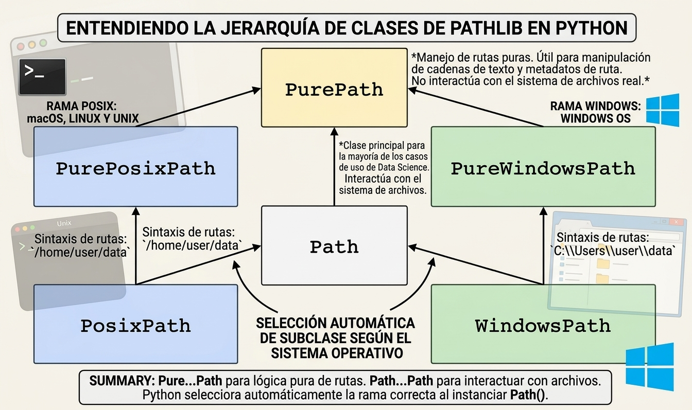
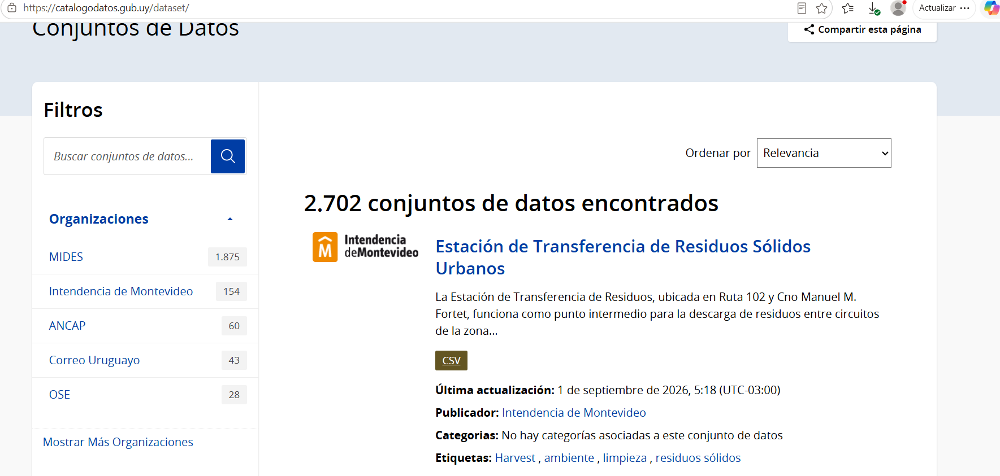

## Espacio de trabajo y organización de proyectos de ciencia de datos

- Una buena organización de archivos es la base de cualquier proyecto profesional
- Estructura de directorios: mantener una estructura clara e independiente del sistema:

data/raw/ (datos originales e inmutables)

data/processed/ (limpios)

notebooks/ o src/ o scripts (código)

outputs/ o resultados (reportes y modelos)

## Rutas

- ¿qué son las rutas?: definen en qué carpeta y archivos estoy trabajando en el proyecto de ciencia de datos
- Preferible usar rutas relativas y no absolutas, porque las rutas absolutas impiden la reproducibilidad de los proyectos.
- Ruta relativa: "data/raw/"
- Ruta absoluta: "C:/Users/..."
- Las rutas son texto (=string/=character) para los lenguajes de programación
- Existen paquetes y funciones que interpretan la ruta como tal

## Trabajar con rutas {.scrollable}

::: panel-tabset
## R {.scrollable}

```{r}
#| echo: true
getwd() # al ejecutarlo me dice en dónde está parado el entorno ahora
# sirve para fijar la ruta del entorno o espacio de trabajo, genera rutas absolutas no relativas
setwd("C:/Users/jodavyt/Documents/GitHub/Introduccion-a-la-ciencia-de-datos/clases/clase4") 
```

## Python {.scrollable}

Antes, si estas trabajando dentro de RStudio ejecuta (dentro de VS no es necesario)

```{r}
#| echo: true
#| eval: false
reticulate::py_require(c("pandas", "numpy", "matplotlib"))
```

En python permite trabajar con rutas absolutas y relativas:

```{python}
#| echo: true
#| eval: false
import os

# es el equivalente a getwd() de R
os.getcwd()
# Subir un nivel en el árbol de carpetas (equivalente a 'cd ..')
os.chdir("..")
os.getcwd()
```

```{python}
#| echo: true
#| eval: false
# Entrar a una subcarpeta desde el directorio actual
os.chdir("clases/clase4")
# ruta absoluta:
os.chdir("C:/Users/jodavyt/Documents/GitHub/Introduccion-a-la-ciencia-de-datos/clases/clase3")
```
:::

## Trabajar con rutas: el enfoque moderno

Usar con paquetes para trabajar desde la raíz del proyecto y sus subcarpetas.



## Trabajar con rutas: el enfoque moderno {.scrollable}

::: panel-tabset
## R

```{r}
#| echo: true
# 1 - instalar paquete
#install.packages("here")
# 2- cargar paquete
library(here)
```

## Python

```{python}
#| echo: true
# 1 - instalar paquete
#pip install pathlib
# 2 - cargar paquete
from pathlib import Path
# listado de subdirectorios
p = Path('.')
```
:::

## Carga de csv

Fuente: Catalogo de datos abiertor Uy



## Leer csv{.scrollable}

```{r}
setwd("C:/Users/jodavyt/Documents/GitHub/Introduccion-a-la-ciencia-de-datos") 
```

::: panel-tabset

## R

```{r}
#| echo: true
library(here)
library(readr)

# 1. Construir la ruta relativa hacia el archivo CSV
# Estructura esperada: tu_proyecto/data/raw/datos.csv
archivo <- "cantidad_de_residuos_en_la_estacion_de_transferencia_2023.csv"
ruta_csv <- here("clases", "clase4", archivo)

# 2. Verificar que el archivo exista
if (!file.exists(ruta_csv)) {
  stop(paste("No se encontró el archivo en:", ruta_csv))
}

# 3. Cargar el archivo CSV
df <- read_csv(ruta_csv)

# 4. Inspección inicial de los datos
cat("--- Archivo cargado exitosamente desde:", basename(ruta_csv), "---\n")
print(spec(df))  # Muestra el tipo de dato asignado a cada columna
head(df)
```

## Python

```{python}
#| echo: true
#| eval: false
from pathlib import Path
import pandas as pd

# 0. nombre archivo
archivo = "cantidad_de_residuos_en_la_estacion_de_transferencia_2023.csv"

# 1. Definir la ruta raíz del proyecto o del directorio de trabajo actual
BASE_DIR = Path.cwd()

# 2. Construir la ruta relativa de forma segura utilizando el operador /
# Estructura esperada: tu_proyecto/data/raw/datos.csv
ruta_csv = BASE_DIR / "clases" / "clase4" / archivo

# 3. Verificar que el archivo realmente existe antes de cargarlo
if not ruta_csv.exists():
    raise FileNotFoundError(f"No se encontró el archivo en: {ruta_csv}")

# 4. Cargar el archivo CSV
df = pd.read_csv(ruta_csv)

# 5. Inspección inicial de los datos
print(f"--- Archivo cargado exitosamente desde: {ruta_csv.name} ---")
print(df.info())
print("\nPrimeras 5 filas:")
print(df.head())
```

:::

## Data profiling/Inspección de datos/Reconocimiento de datos{.scrollable}

Actividades esenciales:

- Evaluar el tamaño del archivo y las necesidades de procesamiento
- Evaluar si el caso a analizar está completo con los datos obtenidos: filas (unidades de observación) y columnas (características o variables)
- Confirmar el tipo de datos obtenidos
- Identificar el delimitador (separación entre columnas)
- Revisar inconsistencias en los nombres de las variables
- Esta etapa debe culminar con un código definitivo de carga de datos (tipo de conexión, tipo de archivos, tipos de datos, completitud)

## Unidad de observación{.scrollable}

- La unidad de observación refiere al objeto de estudio
- Permite identidicar las columnas IDs por las cuales se podrían unir datos
- Ejemplos video juegos:
  - Nivel Acción. **Fila:** Evento atómico (*Acción dentro del juego*), ejemplo event_id.
  - Nivel Partida. **Fila:** Partida (*Match*) o Jugador-Partida (*Player-Match*), ejemplo campos: `match_id`, `player_id`, `kills`, `deaths`, `win_bool`.
  - Nivel jugador. **Fila:** Un Jugador único (*Perfil Agregado*), por ejemplo calcular predicción de abandono,retención a 7/30 días y gasto acumulado. **Campo:** `player_id`
  - Nivel título. **Fila:** Un videojuego o título (*App Level*). **Objetivo:** Estudio de catálogo, estrategia de precios y competencia por género. **Campos:** `app_id`, `title`, `genre`, `price`, `peak_concurrent_users`.

## Problemas de identificación de datos e integración{.scrollable}

- Verificar consistencia de formato de IDs, ¿por qué? porque son las variables mediante las cuales se unen distintas tablas de datos.
- Verificar duplicados
- Distintas fechas de generación de registros, por ejemplo: la solicitud de un tratamiento se realiza en diciembre de 2025 y se realiza en 2026
- Duplicados: más de un registro por IDs, ¿es necesario o se quiere mantener
- Solución: comenzar con una lista de los NO SÉ.

## Data profiling: identificador{.scrollable}


::: panel-tabset
```{r}
#| echo: true
# dimensiones y estructura de los datos
str(df) # 1222 filas y 41 columnas
# filas únicas: detectando la columna que contiene el ID
length(unique(df$matricula_letra)) #¿cuál es la columna identificador?
```

```{r}
#Ejercicio identificar la variable ID
```


```{python}
#| echo: true
#| eval: false
import pandas as pd

# 1. Dimensiones y estructura de los datos (Equivalente a str(df))
df.info()
# Nota: df.shape te da exactamente las dimensiones (filas, columnas) -> (1222, 41)

# 2. Filas únicas: detectando la columna que contiene el ID (Equivalente a length(unique(...)))
df["matricula_letra"].nunique()
```

:::

## Data profiling 2: valores faltantes{.scrollable}

```{r}
#| echo: true
colSums(is.na(df)) # Conteo de NA por columna
sapply(df, function(x) sum(x == "" | x == "N/A", na.rm = TRUE)) # Falsos nulos
```

## Data profiling 3: duplicados{.scrollable}

```{r}
#| echo: true
sum(duplicated(df)) # Cantidad de filas exactamente iguales
```
```{python}
#| echo: true
#| eval: false
df.duplicated().sum() # Cantidad de filas exactamente iguales
```

