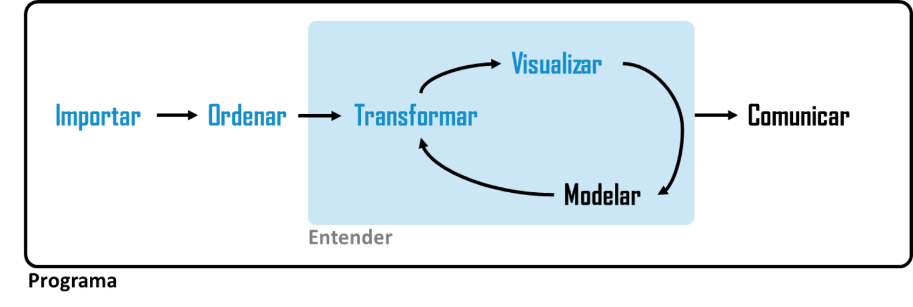

# 1. El Flujo de Análisis de Datos

---


{width=80%}

---

## 1.1 Ingesta / Carga
- **Definición:** Es la primera fase del ciclo de vida donde se capturan, extraen e importan los datos crudos (*raw data*) desde diversas fuentes de origen hacia el entorno de procesamiento o almacenamiento analítico.
- **Objetivo central:** Garantizar la disponibilidad y la integridad inicial de la información, registrando el origen exacto sin modificar ni alterar los datos originales durante este paso.
- **Desafíos técnicos:** Gestión de errores en la red o interrupciones en conexiones de origen, adaptabilidad ante esquemas variables y control de duplicaciones durante el transporte.

---

## 1.2 Perfilado de Datos (*Data Profiling*)
- **Definición:** Proceso sistemático de inspección y evaluación estadística sobre los datos crudos recién ingestados, realizado antes de aplicar cualquier regla de modificación o limpieza.
- **Objetivo central:** Comprender la estructura, la calidad real y la salud del conjunto de datos para diagnosticar anomalías antes de transformarlo.
- **Métricas e inspección:** 
  - Conteo de nulos y cálculo de cardinalidad (cantidad de valores únicos por columna).
  - Distribuciones de frecuencia, detección de tipos de datos inconsistentes y detección de rangos fuera de límite (*outliers*).
  - Identificación de patrones de formato erróneos (ej. formatos de fecha mezclados o teléfonos mal estructurados).

---

## 1.3 Limpieza y Preparación (*Data Wrangling*)
- **Estandarización de tipos de datos:** Conversión explícita de campos de texto a tipos estructurados adecuados, como enteros (`INT`), decimales (`NUMERIC`), fechas (`DATE`) o booleanos.
- **Tratamiento de faltantes y errores:** Imputación fundamentada de valores nulos (`NULL`), corrección de inconsistencias tipográficas y eliminación guiada de registros corruptos según los hallazgos del perfilado.
- **Deduplicación y normalización:** Eliminación de registros idénticos o lógicamente repetidos, acomodando las columnas a un estándar coherente para el sistema.

---

## 1.4 Exploración (*EDA - Exploratory Data Analysis*)
- **Análisis estadístico descriptivo:** Evaluación profunda mediante métricas de tendencia central (media, mediana, moda), dispersión (desviación estándar, varianza) y percentiles.
- **Análisis de relaciones:** Identificación de correlaciones entre variables, detección de agrupamientos naturales (*clustering*) y comportamiento de las variables a lo largo del tiempo.
- **Validación con el negocio:** Comprobación de que las distribuciones y los datos resultantes respetan las reglas operativas y la lógica del dominio de aplicación.

---

## 1.5 Transformación y Modelado
- **Ingeniería de atributos (*Feature Engineering*):** Creación de nuevas variables calculadas a partir de las existentes (ej. cálculo de margen operativo, tasa de retención o antigüedad de cliente).
- **Agregación de datos:** Resumen y consolidación de la información en diferentes niveles de granularidad (métricas diarias, mensuales, por categoría o región).
- **Modelado relacional y analítico:** Organización de las variables en esquemas estructurados (como tablas de hechos y dimensiones) conectadas mediante claves primarias y foráneas.

---

## 1.6 Entrega de Resultados
- **Definición:** Etapa final donde el valor generado por la transformación de los datos se distribuye hacia sus destinos de consumo final según las necesidades de la organización.
- **Destinos de los resultados:**
  - **Tablas o Vistas SQL:** Creación de nuevas columnas, tablas físicas o vistas (`Views`) en la base de datos para que otros sistemas operativos consuman los datos limpios.
  - **Cuadros de Mando (*Dashboards*):** Publicación en herramientas de BI (Power BI, Metabase, Tableau) para visualización interactiva y monitoreo continuo.
  - **Reportes Formales:** Generación automática de documentos estáticos en PDF o HTML para auditorías y presentaciones directivas.
  - **Archivos de Hoja de Cálculo:** Exportación hacia planillas (Excel, Google Sheets) para consumo directo por parte de usuarios finales.
  - **Modelos de Machine Learning:** Alimentación de tuberías (*pipelines*) de entrenamiento automático para sistemas predictivos.
  - **Webhooks y APIs Externa:** Consumo por microservicios o aplicaciones cliente que requieren consumir la información procesada en tiempo real.

---

# 2. Métodos y Tipos de Carga de Datos

---

## 2.1 Carga Inicial (*Full Load*)
- **Mecanismo:** Lectura e importación total del volumen de datos disponible por única vez o para reiniciar el almacenamiento de forma completa.
- **Caso de uso:** Poblamiento inicial de bases de datos nuevas, migraciones completas de sistema o creación de respaldos históricos.
- **Ventajas y desventajas:** 
  - *Ventaja:* Garantiza la consistencia completa de la base sin depender de estados o cargas previas.
  - *Desventaja:* Elevado consumo de tiempo, ancho de banda y capacidad de cómputo en volúmenes masivos.

---

## 2.2 Carga Incremental
- **Mecanismo:** Identificación, captura e inserción exclusiva de los registros que se han creado, modificado o actualizado desde la última ejecución.
- **Estrategias de detección:**
  - Control por marcas de tiempo (*timestamps* de actualización).
  - Secuencias incrementales numéricas.
  - Captura de cambios en la base de datos (*CDC - Change Data Capture*).
- **Ventajas y desventajas:**
  - *Ventaja:* Mínimo consumo de recursos de red y ejecución extremadamente rápida.
  - *Desventaja:* Requiere construir y mantener una lógica técnica más compleja para evitar duplicaciones o inconsistencias.

---

## 2.3 Formatos de Origen: Archivos Planos y Estructurados
- **CSV / TSV / TXT:** Formatos basados en texto con separadores definidos (comas, tabuladores). Son livianos, universales y legibles por cualquier sistema, pero no guardan tipos de datos ni reglas de integridad.
- **Excel (`.xlsx`):** Ampliamente extendido en la gestión administrativa. Admite múltiples pestañas y formato visual, pero presenta bajo rendimiento y restricciones de tamaño en volúmenes masivos.

---

## 2.4 Formatos de Origen: Semiestructurados
- **JSON:** Formato basado en pares clave-valor y arreglos. Muy flexible y estándar nativo de la Web y APIs modernas.
- **XML:** Lenguaje de marcado basado en etiquetas jerárquicas strictly estructuradas. Común en integraciones empresariales e intercambios de datos legacy.

---

## 2.5 Formatos de Origen: Masivos / Columnares
- **Apache Parquet:** Formato binario columnar comprimido. Permite leer solo las columnas necesarias para una consulta, optimizando drásticamente la analítica sobre grandes volúmenes.
- **Apache Avro:** Formato binario orientado a filas que almacena el esquema en formato JSON. Optimizado para transmisión de eventos en tiempo real.
- **ORC:** Formato columnar altamente comprimido para acelerar lecturas complejas dentro de entornos analíticos masivos.

---

## 2.6 Formatos de Origen: Fuentes Externas
- **APIs REST:** Interconexión con servicios web externos que retornan datos bajo demanda mediante peticiones HTTP en formatos estructurados.
- **Web Scraping:** Extracción automatizada de información estructurada a partir del código fuente de sitios web.
- **Réplicas de Bases de Datos:** Conexión directa a motores transaccionales (OLTP) mediante protocolos nativos para extraer tablas del sistema.

---

# 3. Integradora: Flujo de Trabajo con PostgreSQL

---

## 3.1 Arquitectura de Integración
- **Flujo de trabajo completo:**
  $$\text{Fuentes} \longrightarrow \text{Ingesta} \longrightarrow \text{Perfilado} \longrightarrow \text{PostgreSQL} \longrightarrow \text{Ciencia de Datos} \longrightarrow \text{Entrega (SQL, BI, APIs)}$$
- **El rol de PostgreSQL:** Actúa como el centro neurálgico del procesamiento relacional y semianalítico, recibiendo las cargas y sirviendo la información limpia a los diferentes destinos.

---

## 3.2 El Rol de PostgreSQL en el Flujo
- **Tratamiento nativo multiformato:** Capacidad para almacenar e indexar datos relacionales tradicionales junto con estructuras flexibles (`JSONB`).
- **Capa analítica persistente:** Creación de *Views* y *Materialized Views* para procesar reglas de negocio y ofrecer tablas analíticas optimizadas.
- **Conectividad directa:** Compatibilidad con drivers JDBC/ODBC que permiten entregar los resultados directamente a herramientas de BI, scripts de Python o sistemas cliente.

---

# 4. Debate Técnico: ¿Es Excel una Base de Datos?

---

## 4.1 Excel es una Hoja de Cálculo
- **Diseño de interfaz:** Está pensado para la edición manual, el cálculo reactivo celda a celda y la presentación visual de datos de pequeña escala.
- **Ausencia de integridad referencial:** No fuerza relaciones estrictas entre tablas; una fila puede contener tipos de datos totalmente mixtos en la misma columna.
- **Limitaciones de concurrencia y tamaño:** No soporta acceso simultáneo masivo de escritura y está limitado a un máximo fijo de filas por hoja ($1\,048\,576$ filas).

---

## 4.2 Por qué PostgreSQL sí es una Base de Datos Relacional
- **Motor SGBD / DBMS:** Diseñado para gestionar transacciones seguras con propiedades ACID (Atomicidad, Consistencia, Aislamiento y Durabilidad).
- **Tipado e integridad estricta:** Exige esquemas donde cada columna tiene un tipo de dato único, claves primarias, claves foráneas y restricciones (*constraints*).
- **Concurrencia masiva:** Maneja miles de conexiones simultáneas de lectura y escritura sin corromper el almacenamiento ni degradar el sistema.

# 5 Ciclo de vida - Despliegue de modelos

---

## 5.1 Ciencia de Datos (Modelado Predictivo y Avanzado)
- **Definición:** Etapa donde se aplican técnicas avanzadas de aprendizaje automático (*Machine Learning*), estadística inferencial y algoritmos predictivos sobre los datos limpios y estructurados.
- **Objetivo central:** Evolucionar del análisis descriptivo ("qué pasó") al análisis predictivo ("qué pasará") y prescriptivo ("qué debemos hacer").
- **Componentes clave:**
  - **Selección de algoritmos:** Elección de modelos según el problema (clasificación, regresión, *clustering*, series temporales, NLP).
  - **Entrenamiento y Validación:** División de los datos en conjuntos de entrenamiento (*train*) y prueba (*test*) para calibrar el modelo.
  - **Evaluación de métricas:** Medición del desempeño mediante precisión, *recall*, $F1\text{-score}$, $R^2$ o error cuadrático medio ($RMSE$).
  - **Optimización de hiperparámetros:** Ajuste fino de las variables internas del algoritmo para evitar el sobreajuste (*overfitting*).

---

## 5.2 Despliegue de Modelos (*MLOps*)
- **Definición:** Proceso de llevar un modelo entrenado desde el entorno de desarrollo a un entorno de producción para que realice predicciones operativas en tiempo real o por lotes.
- **Integración con el sistema:**
  - Consumo directo de datos procesados almacenados en **PostgreSQL**.
  - Generación de resultados que alimentan la fase de entrega (predicciones, puntuaciones de riesgo, segmentación de clientes).
  
```{mermaid}
%%| fig-width: 6
%%| out-width: 70%
graph LR
    subgraph Datos ["1. Pipeline de Datos"]
        A[(Fuentes Raw)] --> B[Ingesta]
        B --> C[Perfilado y Limpieza]
        C --> D[(PostgreSQL)]
    end

    subgraph ML ["2. Pipeline de Machine Learning"]
        D --> E[Feature Engineering]
        E --> F[Entrenamiento del Modelo]
        F --> G[Evaluación y Registro]
    end

    subgraph Operaciones ["3. MLOps y Despliegue"]
        G --> H[API / Servicio Inferencia]
        H --> I[Monitoreo Drift / Performance]
        I -- Reentrenamiento --> F
    end

    subgraph Consumo ["4. Entrega"]
        H --> J[Predicciones en BD]
        H --> K[Dashboards / BI]
    end

    classDef db fill:#336791,stroke:#fff,stroke-width:2px,color:#fff;
    classDef ml fill:#2e7d32,stroke:#fff,stroke-width:2px,color:#fff;
    class D db;
    class F,G,H ml;
```

  
