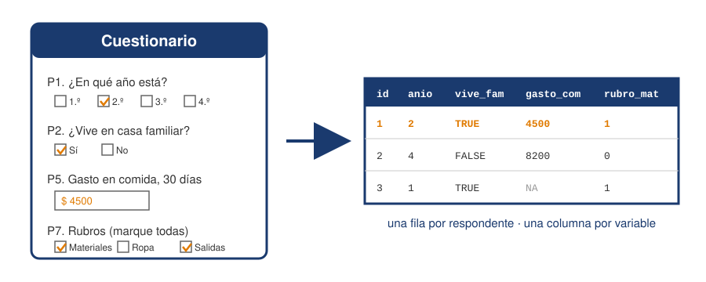
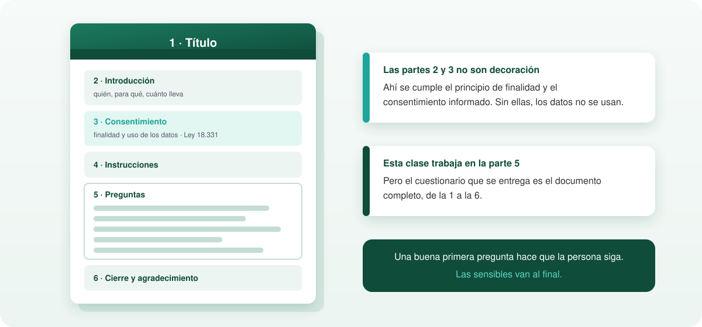
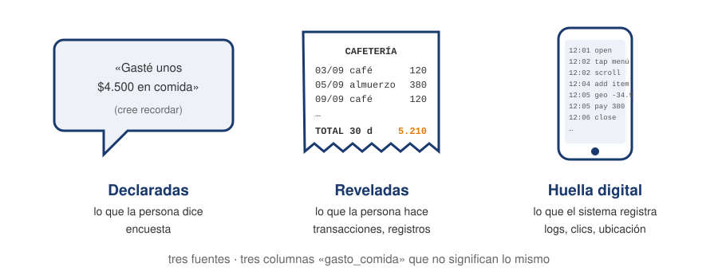
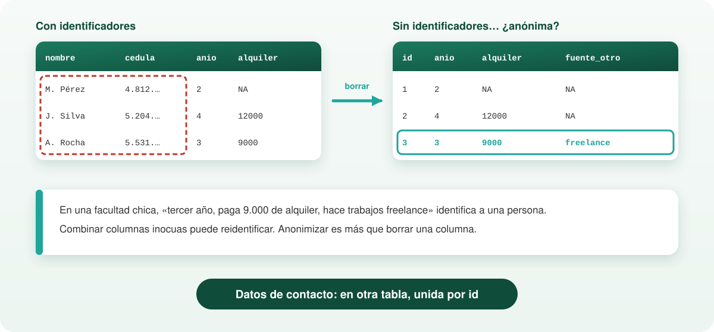
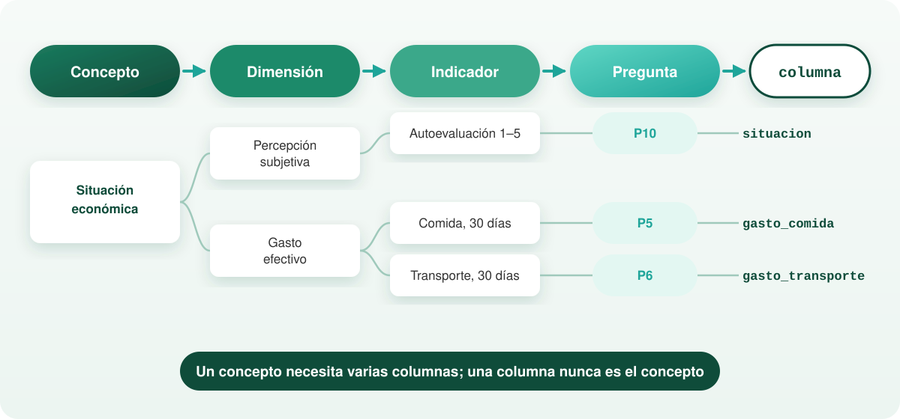
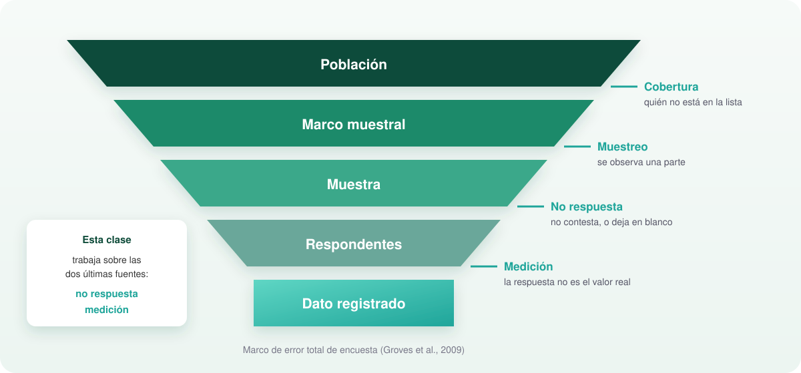
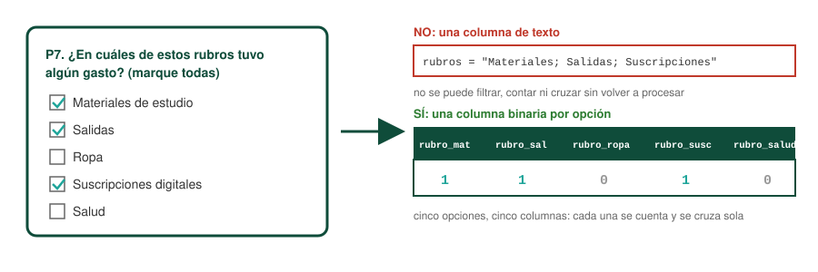
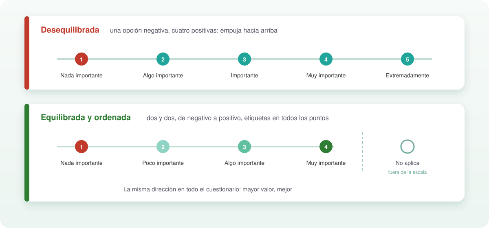
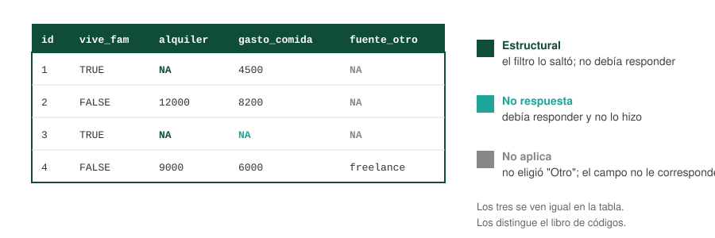

<!-- Estilo CSS global para evitar que las imágenes se salgan de las diapositivas -->
<style>
.reveal section img {
  max-height: 500px !important; /* Limita la altura máxima de cualquier imagen */
  object-fit: contain;          # Ajusta la imagen proporcionalmente sin recortarla
}
</style>

## Las encuestas, que son


Las encuestas son herramientas descriptivas que emplean preguntas para recopilar información estadística sobre algún aspecto de una población.

## ¿Conviene hacer una encuesta?

Tres preguntas antes de empezar (Bulut):

1. **¿Hay tiempo?** Diseñar, probar y aplicar una encuesta de calidad lleva semanas. Si el plazo es menor que esa estimación, no es el instrumento adecuado.
2. **¿Hay recursos?** Tiempo de las personas, plataforma, incentivos, procesamiento. Sin eso, la encuesta se hace mal o no se termina.
3. **¿Ya existen los datos?** Antes de preguntar, buscar si otra fuente ya responde: registros administrativos, encuestas anteriores, datos transaccionales de la diapositiva anterior.

Una encuesta se justifica cuando lo que se necesita no está en ninguna otra parte: percepciones, intenciones, razones, o hechos que ningún sistema registra.

<!-- ============================================================
     BLOQUE 2 — insertar ANTES de "## Una pregunta es una medición"
     (es decir, después de "## Unidades")
     ============================================================ -->


## ¿Es la encuesta la herramienta adecuada?

- Las encuestas son más adecuadas para recopilar datos sobre fenómenos humanos no observables. Estos incluyen actitudes, creencias y opiniones, pero también pueden incluir informes de comportamientos y acciones que de otro modo serían inmensurables (o muy difíciles de medir). 

- El uso de una encuesta debe alinearse lógicamente con las preguntas subyacentes que se formulan y las variables o resultados que se estudian. 

- Además, los investigadores deben describir claramente en sus artículos la justificación de esas medidas y el uso (o usos) posterior de una encuesta. Así como seguir los protocolos éticos y las leyes o reglamentaciones de uso y/o extracción de datos.


## Objetivo del bloque

Al terminar, cada pregunta que se escriba en un cuestionario debería poder responder tres cosas:

1. Qué columna genera en la tabla de datos.
2. De qué tipo es esa columna.
3. Cómo se codifican las respuestas y los faltantes.

No se discute el objeto de estudio ni el marco teórico. Solo el armado.

## La regla básica

**Diseñar la tabla antes que el formulario.**

- Filas: una por respondente.
- Columnas: una por variable.

Si no se puede dibujar la columna que produce una pregunta, la pregunta no va.



## Ponerse en el lugar del respondente

Dos objetivos del proceso de redacción (Bulut):

1. Leer cada pregunta como la leería alguien de la población, no como la lee quien la escribió. Lo que es obvio para el diseñador rara vez lo es para el respondente.
2. Escribir preguntas claras y breves que **distingan** a los respondentes. Una pregunta a la que todos contestan lo mismo no aporta información, aunque esté bien escrita.

**Legibilidad**: revisar ortografía y gramática, y medir la dificultad de lectura. Para textos en español existen adaptaciones del índice de Flesch (Fernández-Huerta, INFLESZ); un cuestionario para población general debería leerse sin esfuerzo a nivel de enseñanza media.

<!-- ============================================================
     BLOQUE 5 — REEMPLAZA la diapositiva "## Escalas" (la vieja de tres viñetas)
     Van cuatro diapositivas en su lugar.
     ============================================================ -->


## Pasos del diseño{.scrollable}

```{mermaid}
%%| fig-width: 9
flowchart TD
    A[1. Definir finalidad, <br> población y unidad de análisis] --> B[2. Operacionalizar: <br> concepto → dimensiones → indicadores]
    B --> C[3. Dibujar la tabla objetivo: <br> columnas y tipo de cada una]
    C --> D[4. Escribir el libro de códigos: <br> valores, orden, faltantes]
    D --> E[5. Redactar preguntas y opciones: <br> el formato fija el tipo de variable]
    E --> F[6. Ordenar: general → específico, <br> filtros, sensibles al final, longitud]
    F --> G{7. Revisar}
    G -->|validez y confiabilidad| E
    G -->|datos sensibles, consentimiento| A
    G -->|aprobado| H[8. Prueba piloto]
    H -->|hay problemas| E
    H -->|funciona| I[9. Campo]
    I --> J[10. Cargar y declarar tipos <br> según el libro de códigos]
```

## Elementos

Un cuestionario completo tiene seis partes, no solo las preguntas (Bulut):

1. Título.
2. Texto introductorio.
3. Consentimiento o carta de información.
4. Instrucciones para completarlo.
5. Las preguntas.
6. Cierre y agradecimiento.

------------------------------------------------------------------------



------------------------------------------------------------------------

## Ejemplo de trabajo

Encuesta de gasto mensual a estudiantes universitarios. Once preguntas en tres bloques:

**A. Perfil**
1. ¿En qué año de la carrera está?
2. ¿Vive en la casa familiar?
3. ¿Cuánto paga de alquiler por mes?
4. ¿Trabaja actualmente?

**B. Gastos en los últimos 30 días**
5. ¿Cuánto gastó en comida fuera de casa?
6. ¿Cuánto gastó en transporte?
7. ¿En cuáles de estos rubros tuvo algún gasto? (marque todas)
8. ¿Lleva registro de sus gastos?

**C. Ingresos y percepción**
9. ¿Cuál es su principal fuente de ingresos?
10. ¿Cómo describiría su situación económica?
11. ¿Qué gasto le resulta más difícil de controlar?

Antes de seguir: ¿cuántas columnas tiene la tabla resultante?

# Fundamentos

## Fuente de datos



## De dónde salen los datos sobre personas{.scrollable}

Una encuesta es una de varias formas de generar datos. Se distinguen por quién decide qué se registra.

| Fuente | Qué se registra | Quién decide qué se registra | Qué se obtiene | Qué se pierde |
|---|---|---|---|---|
| **Preferencias declaradas** (encuesta) | Lo que la persona dice | El diseñador del cuestionario | Percepciones, intenciones, razones; cualquier cosa que se pueda preguntar | Precisión: memoria, deseabilidad social, no respuesta |
| **Preferencias reveladas** (transacciones, registros administrativos) | Lo que la persona hace, inferido de sus elecciones | El sistema que opera la transacción | Comportamiento efectivo sin depender de la memoria ni de la honestidad | El "por qué"; todo lo que el sistema no registra |

------------------------------------------------------------------------

| **Huella digital** (logs, clics, ubicación, tiempo en pantalla) | Comportamiento como subproducto de usar un sistema | Nadie, en el sentido de medición: es un residuo técnico | Volumen y granularidad | Definición: cada campo hay que reinterpretarlo como si fuera una pregunta |

En el ejemplo, "cuánto gastó en comida fuera de casa" se puede obtener de tres maneras: preguntándolo (P5), leyendo los cobros con tarjeta de estudiante en la cafetería, o leyendo los registros de una app de pedidos. Los tres producen una columna `gasto_comida` que no significa lo mismo.

La idea de preferencia revelada viene de Samuelson (1938): la elección observada informa sobre la preferencia mejor que la declaración. Lo que se pierde es la posibilidad de preguntar por lo que no ocurrió.


------------------------------------------------------------------------

## Datos de comportamiento sin preguntas{.scrollable}

Cuando el dato no sale de un cuestionario, el libro de códigos igual hace falta. La diferencia es que hay que reconstruirlo:

- **Qué mide cada campo.** Un registro `monto` en una tabla de cobros: ¿incluye propina? ¿descuentos? ¿en qué moneda?
- **Qué unidad de análisis tiene.** Un log de la app registra sesiones, no personas. Pasar de sesión a persona es una decisión.
- **Qué faltantes hay y por qué.** Quien paga en efectivo no aparece en los cobros con tarjeta. Es un faltante estructural que nadie diseñó.
- **Quién queda afuera.** Solo se observa a quien usa el sistema. La cobertura la define la tecnología, no el investigador.

Los equipos que trabajan con datos transaccionales y con registros de uso de IA están en esta situación: tienen la tabla, y tienen que escribir el cuestionario que la habría producido.

## Datos personales: marco legal en Uruguay{.scrollable}

- **Ley 18.331** (2008), Protección de Datos Personales y Acción de Habeas Data. Reglamentada por el Decreto 414/009; modificada por la Ley 19.670 (2018), el Decreto 64/020 y la Ley 19.924 (2020). Órgano de control: URCDP.
- Alcanza a toda base de datos con información de personas identificadas o identificables, cualquiera sea su soporte y su origen: lo que se preguntó y lo que se registró sin preguntar.

Principios con consecuencia directa en el diseño:

| Principio | Qué exige | En el cuestionario |
|---|---|---|
| Finalidad | Declarar para qué se recogen los datos y usarlos solo para eso | El propósito se escribe antes de la primera pregunta y no se cambia después |
| Consentimiento previo informado | Manifestación libre, expresa e inequívoca; no se infiere del silencio | Se registra que fue otorgado |
| Pertinencia | No recoger más de lo necesario para la finalidad | El criterio de longitud tiene base legal |
| Seguridad y reserva | Proteger los datos y no divulgarlos | Separar identificadores de respuestas |
| Derechos del titular | Acceso, rectificación, supresión | Hay que poder encontrar a una persona en la base y borrarla |

## Datos sensibles e identificación

**Datos sensibles** (art. 18): origen racial o étnico, preferencias políticas, convicciones religiosas o morales, afiliación sindical, salud, vida sexual. Solo se recogen con consentimiento expreso y por escrito, y con justificación.

Si una pregunta cae en esa lista, la pregunta que corresponde es si hace falta.

**Identificación**:

- `id` es un número correlativo, no la cédula ni el correo.
- Si hay que volver a contactar a la persona, los datos de contacto van en una tabla separada, vinculada por `id`, con acceso restringido.
- Una tabla sin nombres puede seguir identificando: año de carrera, alquiler exacto y fuente de ingresos "Otro: trabajos freelance" pueden bastar para reconocer a alguien en una facultad chica. Anonimizar es más que borrar una columna.

La aplicación a un caso concreto requiere asesoramiento jurídico; lo que corresponde al diseñador de la encuesta es saber que estas obligaciones existen antes de salir a campo.

------------------------------------------------------------------------



------------------------------------------------------------------------

## Una pregunta es una medición{.scrollable}

**Operacionalización**: el camino desde lo que se quiere saber hasta la columna.

concepto → dimensión → indicador → pregunta → variable

En el ejemplo:

| Concepto | Dimensión | Indicador | Pregunta | Variable |
|---|---|---|---|---|
| Situación económica | Percepción subjetiva | Autoevaluación 1–5 | P10 | `situacion` |
| Situación económica | Gasto efectivo | Monto en comida, 30 días | P5 | `gasto_comida` |
| Situación económica | Gasto efectivo | Monto en transporte, 30 días | P6 | `gasto_transporte` |

Un concepto suele necesitar varias columnas. Una columna nunca es el concepto: es un indicador de una de sus dimensiones.

"Diseñar la tabla antes que el formulario" es esto: decidir qué indicadores se necesitan antes de escribir cómo se preguntan.

------------------------------------------------------------------------



------------------------------------------------------------------------

## Niveles de medición

Stevens (1946) distingue cuatro niveles según qué operaciones tienen sentido sobre los valores:

| Nivel | Qué se puede hacer | Ejemplo | En la tabla |
|---|---|---|---|
| Nominal | Distinguir categorías | fuente de ingresos | `fuente_ingreso` |
| Ordinal | Ordenarlas | año de carrera, escala 1–5 | `anio`, `situacion` |
| Intervalo | Medir distancias; el cero es convencional | temperatura en °C | (no hay en el ejemplo) |
| Razón | Distancias y cocientes; el cero es real | pesos gastados | `gasto_comida` |

- Cada nivel permite lo del anterior y algo más.
- El diseño de la pregunta fija el nivel. Después no se puede subir: de tramos no se recupera el monto.
- Sí se puede bajar: de `gasto_comida` se construyen tramos cuando haga falta.
- Promediar una escala 1–5 es tratar una ordinal como de intervalo. Se hace con frecuencia; lo que no se hace es sin declararlo.

## Validez y confiabilidad

Dos propiedades de una pregunta como instrumento de medición:

- **Validez**: mide lo que dice medir. *¿Está conforme con lo que gasta en comida y en transporte?* no mide ninguna de las dos cosas por separado.
- **Confiabilidad**: mide lo mismo cada vez que se aplica. *¿Cuánto gasta en transporte?* sin período de referencia recibe respuestas distintas de la misma persona según el día.

La sección de redacción que sigue es una lista de formas conocidas de perder validez o confiabilidad.

## Fuentes de error

Marco de error total de encuesta (Groves et al. 2009). Cuatro fuentes, en el orden en que aparecen:

| Fuente | Qué es | Dónde se controla |
|---|---|---|
| Cobertura | La lista de la que se saca la muestra no contiene a toda la población | Marco muestral |
| Muestreo | Se observa una parte, no el todo | Diseño muestral |
| No respuesta | Personas seleccionadas que no contestan, o ítems que quedan en blanco | Longitud, orden, redacción |
| Medición | La respuesta registrada no coincide con el valor verdadero | Redacción, opciones, escalas |

Este bloque trabaja sobre las dos últimas. Cobertura y muestreo quedan para otra clase.

------------------------------------------------------------------------



------------------------------------------------------------------------

## Cuánto pesa la no respuesta

Si de $n$ personas seleccionadas responden $r$ y no responden $m = n - r$:

$$
\bar{y}_r - \bar{y} \;=\; \frac{m}{n}\,\bigl(\bar{y}_r - \bar{y}_m\bigr)
$$ {#eq-nr}

El sesgo depende de dos cosas a la vez: **cuántos** no responden ($m/n$) y **cuán distintos** son de los que sí ($\bar{y}_r - \bar{y}_m$).

Una tasa de respuesta baja no sesga si los que faltan gastan igual que los que contestaron. Una tasa alta sí sesga si los que faltan son justamente los que más gastan.


## Unidades

- **Población**: a quién se quiere describir.
- **Unidad de análisis**: sobre qué se hacen afirmaciones (una fila de la tabla).
- **Unidad de respuesta**: quién contesta el cuestionario.

En el ejemplo las tres coinciden: estudiantes de la facultad, un estudiante por fila, contesta el propio estudiante.

No siempre es así. En una encuesta de gasto de hogares la unidad de análisis es el hogar y responde un informante; en una encuesta a empresas responde una persona por la organización. Cuando no coinciden, el cuestionario tiene que decir explícitamente por quién se está respondiendo.

# Tipos de pregunta y variable que generan

## Opción única, sin orden

> P9. ¿Cuál es su principal fuente de ingresos?
> ☐ Familia ☐ Trabajo ☐ Beca ☐ Ahorros ☐ Otro

- Una columna.
- Variable **categórica nominal**: las categorías no se ordenan.
- Se guarda como texto o como código numérico con etiqueta.

## Opción única, con orden

> P1. ¿En qué año de la carrera está?
> ☐ 1.º ☐ 2.º ☐ 3.º ☐ 4.º ☐ 5.º o más

- Una columna.
- Variable **ordinal**: hay orden, pero la distancia entre categorías no está definida.
- El orden debe quedar registrado explícitamente (no se infiere del texto).

## Sí / No

> P2. ¿Vive en la casa familiar? ☐ Sí ☐ No

- Una columna.
- Variable **binaria**. Es una nominal de dos categorías; conviene almacenarla como lógica (`TRUE`/`FALSE`) o como 0/1.

## Escala de valoración

> P10. ¿Cómo describiría su situación económica en los últimos 30 días?
> 1 Muy ajustada · 2 · 3 · 4 · 5 Muy holgada

- Una columna.
- Variable **ordinal**. Que los valores sean números no la vuelve cuantitativa.
- Tratarla como numérica (promediar, por ejemplo) es una decisión analítica que se toma después y se declara. No es una propiedad del dato.

## Numérica directa

> P5. ¿Cuánto gastó en comida fuera de casa en los últimos 30 días? $ ____

- Una columna.
- Variable **cuantitativa** (continua; sería discreta para una cantidad de veces).
- Es la que más información conserva. El costo: preguntas difíciles de recordar o sensibles bajan la tasa de respuesta.

## Numérica por tramos

> P6. ¿Cuánto gastó en transporte en los últimos 30 días?
> ☐ Nada ☐ Hasta $1.000 ☐ $1.001 a $3.000 ☐ $3.001 a $6.000 ☐ Más de $6.000

- Una columna, **ordinal**.
- Se pierde la posibilidad de calcular promedios o de recortar tramos distintos después.
- Se gana tasa de respuesta. Es un intercambio que se decide antes de salir a campo, porque no se puede deshacer.

P5 y P6 preguntan lo mismo (un monto) con dos diseños distintos. Ninguno es correcto en general.

## Selección múltiple

> P7. ¿En cuáles de estos rubros tuvo algún gasto en los últimos 30 días?
> ☐ Materiales de estudio ☐ Salidas ☐ Ropa ☐ Suscripciones digitales ☐ Salud

**No genera una variable.** Genera una columna binaria por opción:

| id | rubro_materiales | rubro_salidas | rubro_ropa | rubro_suscripciones | rubro_salud |
|----|---|---|---|---|---|
| 1  | 1 | 1 | 0 | 1 | 0 |
| 2  | 0 | 1 | 1 | 1 | 0 |

Guardar la respuesta como un solo texto (`"Salidas; Ropa; Suscripciones"`) es el error más frecuente en encuestas armadas sin pensar la tabla.


------------------------------------------------------------------------



------------------------------------------------------------------------

## Pregunta abierta

> P11. ¿Qué gasto le resulta más difícil de controlar? ____________

- Una columna de **texto**.
- No se analiza directamente: requiere codificación posterior (leer, agrupar, asignar categorías). Es la pregunta más cara de procesar.
- Se justifica cuando no se conocen las categorías de antemano o cuando se quiere el lenguaje del respondente.

## Resumen

| Formato de pregunta | Columnas | Tipo de variable | En el ejemplo |
|---|---|---|---|
| Opción única sin orden | 1 | Nominal | P9 |
| Opción única con orden | 1 | Ordinal | P1, P4, P8 |
| Sí / No | 1 | Binaria | P2 |
| Escala 1–5 | 1 | Ordinal | P10 |
| Número | 1 | Cuantitativa | P3, P5 |
| Tramos | 1 | Ordinal | P6 |
| Selección múltiple con k opciones | k | Binarias | P7 |
| Abierta | 1 | Texto (a codificar) | P11 |

Once preguntas, diecisiete columnas.

# Redacción de preguntas

## Una idea por pregunta

> ¿Cree que la comida de la facultad es cara y de mala calidad?

Dos preguntas en una. Quien la considera cara pero de buena calidad no tiene respuesta.

Cada pregunta mide una sola cosa. Si aparece una "y", revisar.

## Lenguaje neutro

> ¿No cree que debería ahorrar más?

Induce la respuesta y contiene una negación (responder "no" es ambiguo).

Formulación neutra: *¿Lleva registro de sus gastos?* o *¿Cómo describiría su situación económica?*

## Período de referencia explícito

> ¿Cuánto gasta en transporte?

¿Por semana, por mes, en un mes típico, en el último mes? Cada persona responderá algo distinto.

*¿Cuánto gastó en transporte en los últimos 30 días?*

"Los últimos 30 días" y "un mes típico" no son equivalentes: uno pide recordar, el otro pide estimar. Se elige uno y se sostiene en todo el cuestionario.

## Categorías exhaustivas y excluyentes

> Alquiler mensual: ☐ Hasta $8.000 ☐ $8.000 a $12.000 ☐ $12.000 a $20.000

- No excluyentes: 8.000 y 12.000 caen en dos tramos.
- No exhaustivas: más de 20.000 no tiene opción.

Toda respuesta posible debe tener exactamente una casilla.

## Selección múltiple disfrazada

> ¿De dónde recibe ingresos? ☐ Familia ☐ Trabajo ☐ Ambos ☐ Otro

"Ambos" delata que la pregunta admite más de una respuesta. Hay dos salidas:

- Selección múltiple: una columna binaria por fuente.
- Opción única con la palabra *principal*: *¿Cuál es su principal fuente de ingresos?* (es lo que hace P9).

# Opciones de respuesta

## Escalas

- **Cantidad de puntos**: 4 obliga a tomar posición; 5 permite un punto neutro. Ninguna es correcta en general; se decide y se mantiene igual en todo el cuestionario.
- **Etiquetas**: etiquetar solo los extremos (1 = Muy ajustada, 5 = Muy holgada) o todos los puntos. Etiquetar todos reduce interpretaciones distintas.
- **Dirección**: mantener siempre el mismo sentido (mayor valor = mejor situación) para no confundir al respondente ni al analista.

------------------------------------------------------------------------



------------------------------------------------------------------------

## "Otro (especifique)" y "No sabe / No contesta"

- **Otro (especifique)** genera dos columnas: la categoría `Otro` en `fuente_ingreso` y un campo de texto `fuente_otro`. Si muchas respuestas caen en "Otro", faltó una categoría.
- **No sabe / No contesta** es una decisión de diseño. Si se ofrece, hay que definir cómo se codifica y distinguirla de la no respuesta (dejar en blanco).




# Orden, filtros y longitud

## Orden

- De lo general a lo específico.
- Preguntas sensibles (montos de ingreso, situación económica) al final: si la persona abandona, ya respondió el resto.
- Las primeras preguntas deben ser fáciles y claramente relacionadas con el tema anunciado.

En el ejemplo: el perfil va primero, los montos de gasto en el medio, ingresos y percepción al final.

## Preguntas filtro

> P2. ¿Vive en la casa familiar? ☐ Sí ☐ No → si Sí, pasar a P4
> P3. ¿Cuánto paga de alquiler por mes? $ ____

Quien responde "Sí" en P2 no tiene P3. Esa celda queda vacía **por diseño**.

Son **faltantes estructurales**. No son lo mismo que la **no respuesta** (la persona debía contestar y no lo hizo). El libro de códigos debe distinguirlos.

## Longitud

Cada pregunta tiene un costo: tiempo del respondente y tasa de abandono.

Criterio para conservar una pregunta: la columna que genera se usa en algún análisis previsto. Si no se sabe para qué se va a usar, se elimina.

# Libro de códigos

## Qué es

El diccionario de variables se escribe **antes** de salir a campo, no después. Es el mismo diccionario del Práctico A y lo que SPSS guarda como metadatos.

| Variable | Etiqueta | Tipo | Valores | Faltante |
|---|---|---|---|---|
| `id` | Identificador | entero | 1, 2, … | no admite |
| `anio` | Año de la carrera | ordinal | 1 < 2 < 3 < 4 < 5+ | NA |
| `vive_familia` | Vive en la casa familiar | binaria | TRUE, FALSE | NA |
| `alquiler` | Alquiler mensual (pesos) | cuantitativa | ≥ 0 | NA si `vive_familia` = TRUE |
| `trabajo` | Situación laboral | ordinal | No < Menos de 20 h < 20 h o más | NA |
| `gasto_comida` | Comida fuera de casa, 30 días (pesos) | cuantitativa | ≥ 0 | NA |
| `gasto_transporte` | Transporte, 30 días | ordinal | Nada < Hasta 1.000 < 1.001–3.000 < 3.001–6.000 < Más de 6.000 | NA |
| `rubro_*` (5) | Tuvo gasto en el rubro | binaria | 0, 1 | NA |
| `registro` | Lleva registro de gastos | ordinal | Nunca < A veces < Siempre | NA |
| `fuente_ingreso` | Principal fuente de ingresos | nominal | Familia, Trabajo, Beca, Ahorros, Otro | NA |
| `fuente_otro` | Otra fuente (texto) | texto | libre | vacío si `fuente_ingreso` ≠ Otro |
| `situacion` | Situación económica, 30 días | ordinal | 1 < 2 < 3 < 4 < 5 | NA |
| `gasto_dificil` | Gasto difícil de controlar (abierta) | texto | libre | vacío |

## Convenciones de nombres

- Minúsculas, sin espacios ni tildes: `gasto_comida`, no `Gasto en comida`.
- Prefijo común para las binarias de una misma selección múltiple: `rubro_materiales`, `rubro_salidas`, `rubro_ropa`, …
- El nombre describe el contenido, no la posición: `alquiler`, no `p3`.

# Cómo queda la tabla

## Lectura y tipos {.scrollable}

::: {.panel-tabset}

### R

```r
library(tidyverse)

encuesta <- read_csv("encuesta_gasto.csv")
glimpse(encuesta)
```

```
Rows: 4
Columns: 17
$ id                  <dbl> 1, 2, 3, 4
$ anio                <dbl> 2, 4, 1, 3
$ vive_familia        <chr> "Sí", "No", "Sí", "No"
$ alquiler            <dbl> NA, 12000, NA, 9000
$ trabajo             <chr> "No", "Sí, 20 h o más", "No", "Sí, menos de 20 h"
$ gasto_comida        <dbl> 4500, 8200, NA, 6000
$ gasto_transporte    <chr> "1.001 a 3.000", "Más de 6.000", "Hasta 1.000", "Nada"
$ rubro_materiales    <dbl> 1, 0, 1, 0
$ rubro_salidas       <dbl> 1, 1, 0, 1
$ rubro_ropa          <dbl> 0, 1, 0, 0
$ rubro_suscripciones <dbl> 1, 1, 0, 1
$ rubro_salud         <dbl> 0, 0, 0, 1
$ registro            <chr> "A veces", "Siempre", "Nunca", "A veces"
$ fuente_ingreso      <chr> "Familia", "Trabajo", "Familia", "Otro"
$ fuente_otro         <chr> NA, NA, NA, "trabajos freelance"
$ situacion           <dbl> 3, 2, 4, 3
$ gasto_dificil       <chr> "salidas", "delivery", NA, "suscripciones"
```

### Python

```python
import pandas as pd

encuesta = pd.read_csv("encuesta_gasto.csv")
encuesta.dtypes
```

```
id                       int64
anio                     int64
vive_familia            object
alquiler               float64
trabajo                 object
gasto_comida           float64
gasto_transporte        object
rubro_materiales         int64
rubro_salidas            int64
rubro_ropa               int64
rubro_suscripciones      int64
rubro_salud              int64
registro                object
fuente_ingreso          object
fuente_otro             object
situacion                int64
gasto_dificil           object
dtype: object
```

:::

Tres faltantes de naturaleza distinta: `alquiler` en los respondentes 1 y 3 (filtro), `gasto_comida` en el 3 (no respuesta), `fuente_otro` en 1, 2 y 3 (no aplica). La tabla no los distingue; el libro de códigos sí.

## Declarar los tipos

::: {.panel-tabset}

### R

```r
encuesta <- encuesta |>
  mutate(
    anio = factor(anio, levels = 1:5, ordered = TRUE),
    vive_familia = vive_familia == "Sí",
    trabajo = factor(trabajo,
      levels = c("No", "Sí, menos de 20 h", "Sí, 20 h o más"), ordered = TRUE),
    gasto_transporte = factor(gasto_transporte,
      levels = c("Nada", "Hasta 1.000", "1.001 a 3.000",
                 "3.001 a 6.000", "Más de 6.000"), ordered = TRUE),
    registro = factor(registro,
      levels = c("Nunca", "A veces", "Siempre"), ordered = TRUE),
    fuente_ingreso = factor(fuente_ingreso),
    situacion = factor(situacion, levels = 1:5, ordered = TRUE)
  )
```

```
$ anio             <ord> 2, 4, 1, 3
$ vive_familia     <lgl> TRUE, FALSE, TRUE, FALSE
$ trabajo          <ord> No, Sí, 20 h o más, No, Sí, menos de 20 h
$ gasto_transporte <ord> 1.001 a 3.000, Más de 6.000, Hasta 1.000, Nada
$ registro         <ord> A veces, Siempre, Nunca, A veces
$ fuente_ingreso   <fct> Familia, Trabajo, Familia, Otro
$ situacion        <ord> 3, 2, 4, 3
```

### Python

```python
encuesta["anio"] = pd.Categorical(encuesta["anio"],
    categories=[1, 2, 3, 4, 5], ordered=True)
encuesta["vive_familia"] = encuesta["vive_familia"] == "Sí"
encuesta["trabajo"] = pd.Categorical(encuesta["trabajo"],
    categories=["No", "Sí, menos de 20 h", "Sí, 20 h o más"], ordered=True)
encuesta["gasto_transporte"] = pd.Categorical(encuesta["gasto_transporte"],
    categories=["Nada", "Hasta 1.000", "1.001 a 3.000",
                "3.001 a 6.000", "Más de 6.000"], ordered=True)
encuesta["registro"] = pd.Categorical(encuesta["registro"],
    categories=["Nunca", "A veces", "Siempre"], ordered=True)
encuesta["fuente_ingreso"] = encuesta["fuente_ingreso"].astype("category")
encuesta["situacion"] = pd.Categorical(encuesta["situacion"],
    categories=[1, 2, 3, 4, 5], ordered=True)
```

```
anio                category
vive_familia            bool
trabajo             category
gasto_transporte    category
registro            category
fuente_ingreso      category
situacion           category
```

:::

El orden de las categorías se declara en el código porque no está en el archivo. Esa declaración sale del libro de códigos.

# Ejercicio

## De la tabla al cuestionario

Se quiere obtener esta tabla a partir de una encuesta a clientes de la cafetería de la facultad. Escribir el cuestionario que la produce: texto de cada pregunta, opciones de respuesta, orden y filtros.

| Variable | Tipo | Valores | Faltante |
|---|---|---|---|
| `id` | entero | 1, 2, … | no admite |
| `frecuencia` | ordinal | Nunca < 1 a 3 veces < 4 a 8 veces < Más de 8 veces | NA |
| `prod_cafe`, `prod_comida`, `prod_frias`, `prod_otros` | binaria (×4) | 0, 1 | NA si `frecuencia` = Nunca |
| `atencion` | ordinal | 1 < 2 < 3 < 4 < 5 | NA si `frecuencia` = Nunca |
| `pago_efectivo`, `pago_tarjeta`, `pago_transferencia` | binaria (×3) | 0, 1 | NA si `frecuencia` = Nunca |
| `estudiante` | binaria | TRUE, FALSE | NA |
| `edad` | cuantitativa | años | NA |
| `mejora` | texto | libre | vacío |

## Qué se verifica

- Toda pregunta tiene período de referencia.
- Hay un filtro después de `frecuencia` y está indicado a dónde saltar.
- `prod_*` y `pago_*` salen de preguntas de selección múltiple, no de opción única con "ambos".
- `atencion` tiene los extremos etiquetados y la misma dirección que el resto del cuestionario.
- `edad` está al final.
- Cuántas preguntas se necesitan para producir trece columnas.

## Cuestionario de referencia {visibility="hidden"}

1. ¿Con qué frecuencia compró en la cafetería en los últimos 30 días? ☐ Nunca ☐ 1 a 3 veces ☐ 4 a 8 veces ☐ Más de 8 veces → si Nunca, pasar a P5
2. ¿Qué productos compró? (marque todas) ☐ Café ☐ Comida ☐ Bebidas frías ☐ Otros
3. ¿Cómo calificaría la atención recibida? 1 Muy mala · 2 · 3 · 4 · 5 Muy buena
4. ¿Con qué medios pagó? (marque todas) ☐ Efectivo ☐ Tarjeta ☐ Transferencia
5. ¿Es estudiante de esta facultad? ☐ Sí ☐ No
6. ¿Qué mejoraría del servicio? ____________
7. ¿Cuántos años tiene? ____

Siete preguntas, trece columnas.

## Para la bitácora

Seis preguntas con problemas. Para cada una: identificar el problema, reescribirla y decir qué tipo de variable produce (y cuántas columnas).

1. ¿Está conforme con lo que gasta en comida y en transporte?
2. ¿No le parece que gasta demasiado en salidas?
3. ¿Cuánto gastó últimamente en ropa?
4. Gasto en transporte: ☐ $0 a $1.000 ☐ $1.000 a $3.000 ☐ $3.000 a $6.000
5. ¿Cómo paga sus gastos? ☐ Efectivo ☐ Tarjeta ☐ Ambos ☐ Transferencia
6. (Primera pregunta del cuestionario) ¿Cuál es el ingreso mensual exacto de su hogar?

## Soluciones {visibility="hidden"}

1. Doble cañón. Separar en dos preguntas; cada una ordinal (escala 1–5).
2. Inducida y con negación. *¿Cuánto gastó en salidas en los últimos 30 días?* Cuantitativa, o tramos (ordinal).
3. Sin período de referencia. *¿Cuánto gastó en ropa en los últimos 30 días?* Cuantitativa.
4. Tramos no excluyentes ni exhaustivos. Nada / Hasta 1.000 / 1.001–3.000 / 3.001–6.000 / Más de 6.000. Ordinal.
5. Selección múltiple disfrazada. Una binaria por medio de pago: `pago_efectivo`, `pago_tarjeta`, `pago_transferencia`.
6. Pregunta sensible al inicio y con precisión innecesaria. Mover al final y ofrecer tramos. Ordinal.

## Fuentes

- Bulut, O. *Survey Design 101, Part I: Introduction to Survey Design*. Centre for Research in Applied Measurement and Evaluation, University of Alberta. Base de las secciones sobre plan, escalas, estructura y piloto.
- Dillman, D. A., Smyth, J. D. y Christian, L. M. (2014). *Internet, Phone, Mail, and Mixed-Mode Surveys: The Tailored Design Method* (4.ª ed.). Wiley.
- Groves, R. M. et al. (2009). *Survey Methodology* (2.ª ed.). Wiley. Marco de error total.
- Johnson, R. L. y Morgan, G. B. (2016). *Survey Scales: A Guide to Development, Analysis, and Reporting*. Guilford. Escalas equilibradas y ordenadas.
- Lozano, L. M., García-Cueto, E. y Muñiz, J. (2008). Effect of the number of response categories on the reliability and validity of rating scales. *Methodology*, 4(2), 73–79.
- Samuelson, P. A. (1938). A note on the pure theory of consumer's behaviour. *Economica*, 5(17), 61–71.
- Stevens, S. S. (1946). On the theory of scales of measurement. *Science*, 103(2684), 677–680.
- Ley 18.331 (2008) y normativa complementaria. URCDP, Uruguay.
