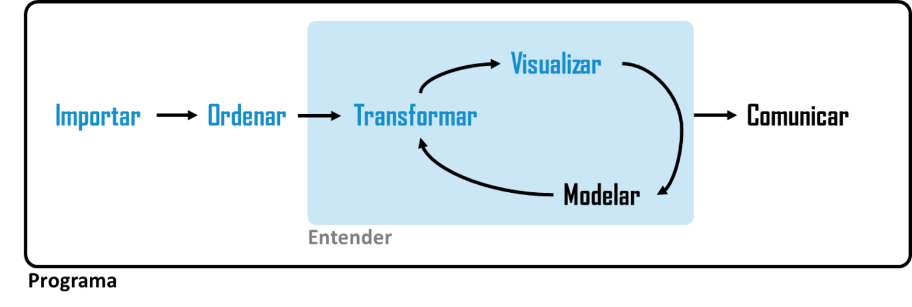

# El proceso

{width=100%}

El trabajo recorre siete pasos básicos de la ciencia de datos. El informe final tiene una sección por paso, en
este orden y con estos títulos.

| Paso | | Correspondencia con el esquema |
|:--|:--|:--|
| 1 | Importar los datos crudos | Importar |
| 2 | Perfilar el dato crudo | *adicional, no aparece en el esquema* |
| 3 | Ordenar y limpiar | Ordenar |
| 4 | Unir tablas | Transformar |
| 5 | Generar nueva información | Transformar |
| 6 | Explorar: visualizar y modelar | Visualizar ⇄ Modelar |
| 7 | Comunicar | Comunicar |

Dos observaciones sobre el esquema.

**El perfilado no está en el diagrama, y es el paso que falta.** Antes de
ordenar y limpiar hay que saber qué se tiene entre manos: cuántas filas,
qué tipos, cuántos faltantes, qué valores toma cada variable, qué se repite. El
perfilado no modifica nada; es el diagnóstico que justifica todo lo que se hace
después. Sin él, la limpieza es a ciegas.

**Los pasos 5 y 6 son un ciclo, no una secuencia.** En el diagrama,
transformar, visualizar y modelar están dentro de un bucle. Se explora, aparece
algo raro, se vuelve a transformar, se vuelve a explorar. El informe se escribe
en orden lineal porque hay que leerlo, pero el trabajo no fue lineal y conviene
que el informe lo diga.

**La caja exterior, `Programa`, no es un paso**: atraviesa todos. Todo lo que se
hace del paso 1 al 7 queda escrito en código ejecutable. No hay pasos manuales
sin registro.

Ningún paso se omite. Un paso que en el trabajo del equipo no tuvo dificultad se
resuelve en un párrafo que explica por qué. Ese párrafo también se evalúa.

# Organización de carpetas

Se sugiere organizar las carpetas en:

- código

- datos/ o data, la cual separar en:

  - datos crudos
  
  - datos finales
  
- resultados

# Entregables finales

- trabajo finalizado en github al 19/11
- documento o informe: una presentación o un informe que muestre todos los pasos.

# Paso 1 — Importar los datos crudos

**Qué se hace.** Traer los datos al entorno de trabajo tal como los entrega la
fuente, sin modificarlos.

**Qué se documenta.**

- De dónde salieron: organismo, plataforma, competencia, o el propio equipo si
  los generó.
- Cómo se obtuvieron: descarga, interfaz de programación, extracción, encuesta,
  registro.
- Cuándo se obtuvieron y en qué formato llegaron.
- Los problemas de la importación misma: codificación de caracteres, separador
  decimal, filas de encabezado, hojas múltiples, tipos que el lector adivinó mal.

**Qué se entrega.** Los archivos originales guardados sin modificar, en una
carpeta aparte. El archivo crudo no se edita nunca.

**Si el equipo generó sus propios datos**, este paso incluye el instrumento
completo, cómo se aplicó, a quiénes, y cuántos no respondieron.

# Paso 2 — Perfilar el dato crudo

**Qué se hace.** Describir lo que se importó, sin cambiarlo todavía. Es un
diagnóstico, no una intervención.

**Qué se documenta.**

- Dimensiones: filas y columnas de cada tabla importada.
- Qué representa una fila. Si no es evidente, se averigua antes de seguir.
- Por cada variable: tipo, cantidad de valores distintos, cantidad de faltantes,
  y mínimo y máximo si es numérica.
- Cómo está codificado el faltante en el original: celda vacía, cero, `-`,
  `999`, `sin dato`, texto libre.
- Categorías que aparecen escritas de más de una forma.
- Valores fuera de rango o imposibles.
- Filas repetidas, y con qué criterio se decidió que dos filas son la misma
  observación.
- Si hay más de una tabla, si la clave que las vincularía identifica de manera
  única las filas de cada una.

**Qué se entrega.** Una tabla de perfilado con una fila por variable. **De ella
sale la lista de problemas a resolver en el paso 3**: cada decisión de limpieza
debe poder rastrearse hasta un hallazgo del perfilado.

**El perfilado se repite después de limpiar**, sobre la tabla final, como
verificación. Esa segunda tabla va en el informe junto a la primera.

# Paso 3 — Ordenar y limpiar

Son dos cosas distintas y se documentan por separado. **Ordenar** es la
estructura de la tabla; **limpiar** es el contenido de las celdas. Una tabla
puede estar ordenada y sucia, o limpia y desordenada.

**Ordenar.** Llevar los datos a una tabla ordenada: una fila por observación,
una columna por variable, un valor por celda. Se documenta qué estaba
desordenado y cómo se resolvió: columnas que en realidad eran valores de una
variable, dos variables metidas en una columna, encabezados ocupando filas,
varias tablas dentro de una planilla.

**Limpiar.** Corregir el contenido, resolviendo los problemas listados en el
perfilado. Se documenta:

- Conversiones de tipo, y qué pasó con los valores que no se pudieron convertir.
- Qué se hizo con los faltantes de cada variable y por qué.
- Duplicados eliminados.
- Categorías unificadas, unidades homogeneizadas, valores imposibles corregidos
  o marcados.

**Qué se entrega.** El conteo de filas antes y después, con la explicación de
cada fila perdida.

# Paso 4 — Unir tablas

**Qué se hace.** Combinar dos o más tablas en una sola, cuando corresponde.

**Qué se documenta.**

- Qué tablas se unieron y qué aporta cada una.
- Cuál es la clave de unión, y si identifica de manera única las filas de cada
  tabla — dato que viene del perfilado.
- Qué tipo de unión se hizo y por qué esa.
- Cuántas filas quedaron sin correspondencia de cada lado y qué se hizo con
  ellas. **Este número se reporta siempre, aunque sea cero.**
- Si la unión cambió la cantidad de filas de manera inesperada, la explicación.

**Si el equipo no unió tablas**, el paso es un párrafo que dice que se trabajó
sobre una única tabla y por qué no hizo falta más.

# Paso 5 — Generar nueva información

**Qué se hace.** Producir datos que no estaban en la fuente: variables nuevas,
agregaciones, indicadores.

**Qué se documenta.**

- Variables creadas: cómo se calcula cada una, a partir de qué y qué mide.
- Agregaciones: por qué grupos, con qué función de resumen, y cuántas
  observaciones tiene cada grupo.
- Transformaciones de escala: per cápita, porcentaje, tasa, logaritmo,
  deflactación, categorización de una variable continua — cada una con su
  justificación, y con el criterio de los cortes si se categorizó.

**Qué se entrega.** Cada variable nueva figura en el diccionario de variables,
con su fórmula.

Este paso y el siguiente se recorren varias veces. Es esperable que la
exploración obligue a volver acá y crear o rehacer una variable.

# Paso 6 — Explorar: visualizar y modelar

**Qué se hace.** Entender el comportamiento de las variables, primero solas y
después entre sí, alternando gráficos y resúmenes numéricos.

**Qué se documenta.**

- Distribución de cada variable relevante antes de relacionarla con otras:
  centro, dispersión, forma, valores extremos.
- Qué relaciones se exploraron entre pares de variables y cómo se midieron.
- Al menos una relación examinada en más detalle: separada por una tercera
  variable, o mirada en subgrupos, para ver si se mantiene.
- Los casos extremos que influyen sobre el resultado, identificados y
  discutidos.
- Qué se buscó y no apareció. Una relación esperada que no está es un resultado.
- Si se ajustó algún modelo: qué se calculó, sobre qué observaciones, y qué
  supone ese cálculo.

**Qué se entrega.** Los gráficos de la exploración, incluidos los que no
confirmaron nada, y una descripción de las idas y vueltas entre este paso y el
anterior.

# Paso 7 — Comunicar

**Qué se hace.** Mostrar lo encontrado a un destinatario definido.

**Qué se documenta.**

- A quién está dirigido el informe y qué sabe ese lector de antemano.
- La afirmación central del trabajo, en una frase.
- Los gráficos y tablas finales, cada uno con título, ejes rotulados con
  unidades y fuente.
- Los límites: qué no puede afirmarse con estos datos y por qué.
- La objeción más fuerte que el propio equipo puede formular contra su
  afirmación central.

**Qué se entrega.** El informe renderizado y la presentación oral de 8 minutos.

# El peso de cada paso cambia según el equipo

# Evaluación

| Criterio | Peso |
|:--|:-:|
| Los dos pasos declarados como énfasis | 35 % |
| Los cinco pasos restantes, resueltos y documentados | 25 % |
| Reproducibilidad: del crudo a la tabla final sin intervención del equipo | 15 % |
| Límites del propio trabajo | 15 % |
| Comunicación | 10 % |

# Calendario

| Instancia | Equipo |Entrega |
|:--|:--|
| Presentación 1 | Pasos 1 y 2 completos (datos importados y perfilados) y declaración de énfasis |
| Presentación 2 | Tabla final construida (pasos 3 a 5), segundo perfilado y diccionario de variables |
| Presentación Final 3 | Exploración avanzada (paso 6) |
| Entrega final | Informe final y github concluido |
